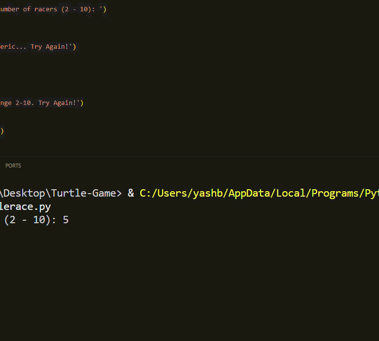

# 🐢 Turtle Racing Simulator (Python)

  

    An interactive <b>Python Turtle Graphics</b> project that simulates a colorful turtle race,
    where each turtle moves forward randomly until one reaches the finish line.
  

  
  
  
  

---

## 🎥 Gameplay Preview

  

---

## 📌 Project Overview

The **Turtle Racing Simulator** is a fun and educational Python project built using the
built-in **Turtle Graphics** module. It visually simulates a race where multiple turtles
compete against each other, moving forward by random distances until one reaches the
finish line.

The randomness ensures that each race has an unpredictable and exciting outcome.

---

## 🎥 Simulation Preview (GIF)

  
  
<i>Real-time visualization of the turtle race simulation using Python Turtle Graphics</i>

## 🎮 How the Simulation Works

1. The user selects the number of turtles (between **2 and 10**)
2. Each turtle is assigned:
   - A unique color  
   - A fixed starting position
3. Turtles move forward by a random distance in each loop iteration
4. The first turtle to cross the finish line is declared the winner 🏆

---

## 🧠 Key Concepts Implemented

- Python Turtle Graphics
- Randomized simulation logic
- User input validation
- Loop-based animation
- Coordinate-based finish line detection
- Modular and readable code design

---

## ⚙️ Core Features

- 🐢 Adjustable number of racers (2–10)
- 🎨 Automatic color assignment
- 🎲 Random movement for fair competition
- 🖥️ Real-time graphical animation
- 🧩 Beginner-friendly and clean code structure

---

## 🛠️ Tech Stack

| Category | Technology |
|--------|------------|
| Language | Python |
| Graphics | Turtle Module |
| Utilities | `random`, `time` |
| Environment | Desktop GUI |

---

## 🎯 Learning Outcomes

Through this project, I strengthened my understanding of:

- Event-driven graphics programming
- Simulation and randomness in games
- Python function structuring
- Visual feedback for algorithmic behavior

---

## 👤 Author

**Yash Brahmankar**  
B.Tech Student | Python Developer | Machine Learning Enthusiast  

---

⭐ *If you found this project useful or interesting, consider starring the repository.*

